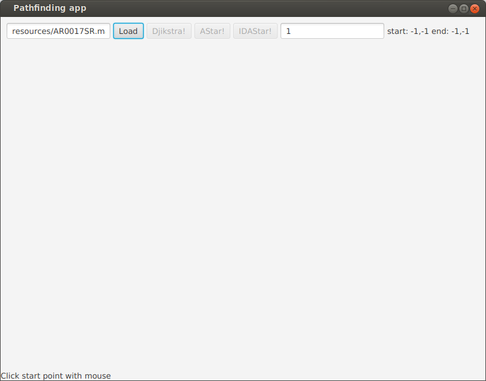
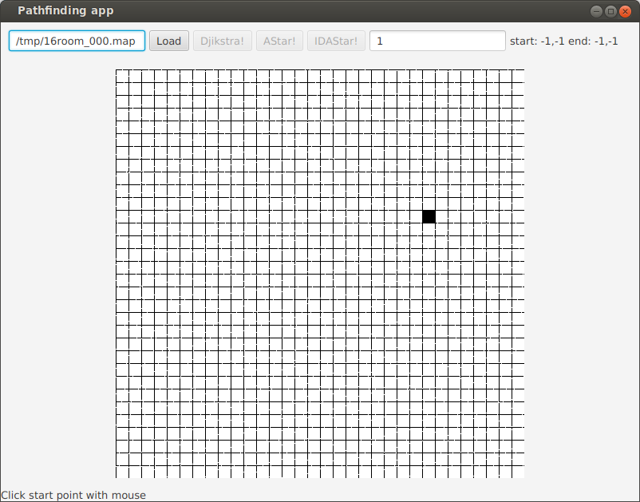
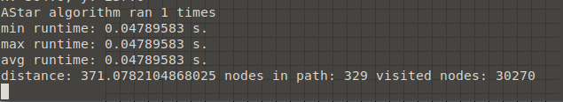
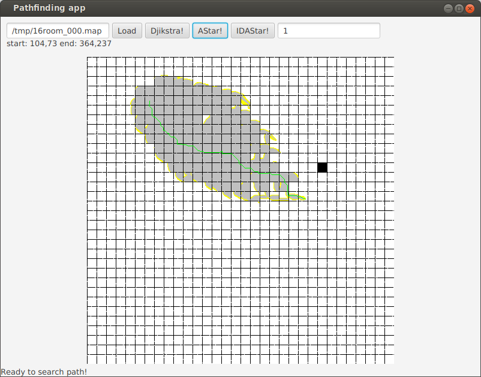
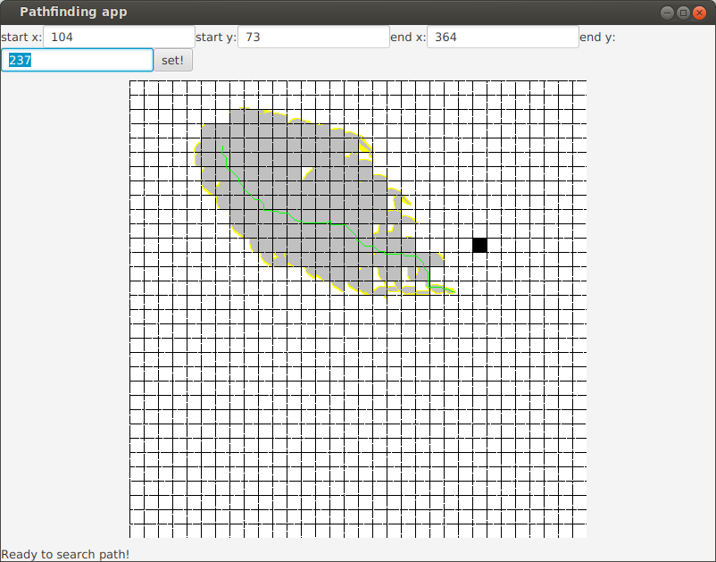

# Käyttöohje

### Lataa release

Lataa [release](https://github.com/jussmaki/pathfinding-algorithms/releases/download/1.0/pathfinding-algorithms.zip) ja pura zip. 

### Vaihtoehtoisesti kloonaa repositorio ja buildaa ohjelma itse 

Lataa ohjelma

```
git clone https://github.com/jussmaki/pathfinding-algorithms/
```

mene kloonattuun kansioon

```
cd pathfinding-algorithms
```

Anna gradlewille tarvittavat oikeudet

```
chmod o+x gradlew
```

Buildaa Gradle projekti

```
./gradlew build
```

Valmis jar on nyt kansiossa build/libs/. Ohjelma on valmis suoritettavaksi komennolla

```
java -jar build/libs/pathfinding-algorithms-all.jar
```

## Ohjelman käyttö

Käynnistä ohjelma komennolla `java -jar pathfinding-algorithms.jar`



Klikkaama hiirellä vasemman yläkulman tekstiä, jolloin voit valita tiedoston. Ohjelman mukana zipissä tulee tiedostoja, joilla ohjelman toimintaa voi kokeilla. Jos kloonasit repositorion tiedostot löytyvät kansiosta resources.



Valitse haluamasi alkupiste ja loppupiste kartalta hiireltä klikkaamalla.

Halutessasi muuttamalla oikeassa yläkulmassa olevaa numeroa, voit valita kuinka monta kertaa sama haku suoritetaan.

Valitse algoritmi ja paina algoritmin nimistä painiketta suorittaaksesi haun.



Algoritmin suoritustietoja tulostuu konsoliin.



Ohjelma näyttää löydetyn polun vihreällä, haun aikana vieraillut solmut harmaalla ja (Djikstrassa ja AStarissa) keltaisella solmut, jotka olivat vielä keossa, kun haku päättyi.

Load painike nollaa tuolokset ja lataa karttatiedoston uudelleen.

#### Tietyn alkupisteen ja loppupisteen syöttäminen



Klikkaamalla käyttöliitymässä tekstiä, jossa nykyiset koordinaatit lukevat, aukeaa valikko, johon halutut koordinatit voi syöttää.

## Vertailu Moving AI Labsin karttoihin ja skenaarioihin

Ohjelmalla voi helposti suorittaa kaikki annetun nimisen kartan skenaariot käynnistämällä ohjelman komennolla `java -jar pathfinding-algorithms.jar <algoritmi> <kartta> <output>`. Parametri algoritmi voi olla djikstra, astar tai idastar (en suosittele). Parametri kartta on kartan (.map) ja samamnnimisen skenaariotiedoston (.map.scen) nimi ilman tiedostopäätettä. Parametri output tarkoittaa tiedoston nimeä johon tallennetaan ohjelman tulostamat tiedot. Toiminnallisuus vaatii että kartta ja scen tiedosto löytyvät samasta kansiosta, jossa ohjelmaa suoritetaan. Ohjelman tuloste näyttää seuraavalta:

```bash
jussmaki@ubuntu:~/pathfinding-algorithms$ java -jar pathfinding-algorithms.jar djikstra lt_house tulos.txt
djikstra 1914896 ns. lt_house start: 20,20 end: 20,23 distance: 3.0 nodes in path: 4 visited nodes: 20
...
djikstra 222904 ns. lt_house start: 30,36 end: 27,30 distance: 7.242640687119285 nodes in path: 7 visited nodes: 47
djikstra 326609 ns. lt_house start: 17,5 end: 22,9 distance: 6.65685424949238 nodes in path: 6 visited nodes: 70
djikstra on map: lt_house.map
scenarios count: 20
total time: 7212310 ns
total time: 0.00721231 s
total distance: 88.84062043356596
total nodes in paths: 96
total visited nodes: 897
```