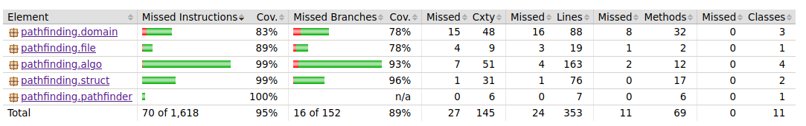

# Testausdokumentti

Tämä dokumentti on vielä vaiheessa. Sen sisältö tulee vielä päivittymään harjoitustyön etenemisen myötä.

## Ohjelman tastaamisesta

Ohjelmalle on suoritettu kehitystyön ohessa manuaalista järjestelmätestausta. Ohjelmalle on testatessa annettu syötteeksi sivulta https://movingai.com/benchmarks/grids.html löytyviä karttoja. Lisäksi ohjelmalle on kirjoitettu yksikkötestejä ja integraatiotestejä.

Tällä hetkellä ohjelmassa on automaattisia testejä kaikille käyttöliittymän ulkopuolisille luokille.

## Omien tietorakenteiden yksikkötestit

MinHeap ja PointStack -luokkien yksikkötestit vertaavat tietorakenteen toimintaan Javan omien toteutusten toimintaan.

### testikattavuus

Testien rivikattavuus on tällä hetkellä 95 prosenttia ja haaraumakatavuus 89 prosenttia.
