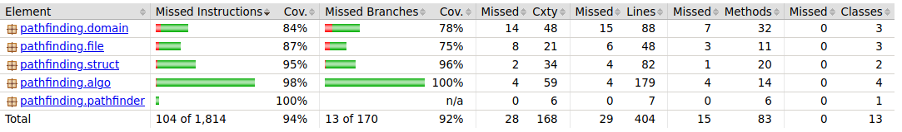
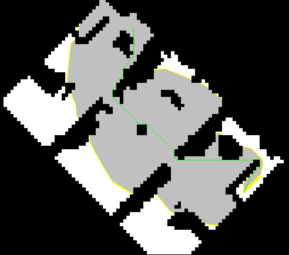

# Testausdokumentti

Ohjelmalle on kirjoitettu kattavat automaattiset yksikkötestit ja integraatiotestit. Ohjelmalle on myös suoritettu kehitystyön aikana ja sen jälkeen manuaalista järjestelmätestausta. Ohjelma tukee [Movin AI Labsin]([https://movingai.com/benchmarks/grids.html) sivulta löytyvien karttojen ja skenaariotiedostojen formaattia. Järjestelmätestauksessa ohjelmalle on annettu syötteeksi näitä tiedostoja.

### Automaattisten testien suorittaminen

Ohjelman JUnit testit voi suorittaa komennolla `./gradlew test`. Testit suoritetaan myös, kun ohjelma buildataan komennolla `./gradlew build`.

### Testikattavuus

Testikattavuuden saa selville komennolla `./gradlew jacocoTestReport`.



Ohjelman testikattavuus on hyvä. Rivikattavuus on 94 prosenttia ja haaraumakatavuus 92 prosenttia.

## Omien tietorakenteiden yksikkötestit

MinHeap ja PointStack -luokkien yksikkötestit vertaavat luokan metodien toiminnan oikeellisuuden lisäksi tietorakenteen toimintaan Javan omien toteutusten toimintaan.

```java
   @Test
    public void orderOfPointsIsCorrectWhenPollingComparedToJavasArrayDeque() {
        Random r = new Random();
        ArrayDeque<Point> javaDeque = new ArrayDeque<>();
        for (int i = 100; i < 1000000; i++) {
            Point p = new Point(r.nextInt(1000), r.nextInt(1000));
            javaDeque.addLast(p);
            ps.push(p);
        }
        while (!javaDeque.isEmpty()) {
            assertEquals(javaDeque.removeLast(), ps.pop());
        }
        assertTrue(ps.isEmpty());
    }
```

Testien syötteistä on pyritty tekemään mahdollisimman samankaltaisia kuin ohjelmaa normaalisti suorittaessa.

## Algoritmien testaamisesta

Algoritmejä testataan ohjelmallisesti omilla syötteillä ja [Movin AI Labsin]([https://movingai.com/benchmarks/) tiedostoilla, vertaamalla algoritmin löytämän lyhimmän polun pituutta benchmark tiedoston ilmoittamaan lyhimmän polun pituuteen.

```bash
380	Moscow_2_1024.map	1024	1024	256	1010	43	215	1521.10973968
380	Moscow_2_1024.map	1024	1024	977	860	4	129	1520.51803588
380	Moscow_2_1024.map	1024	1024	47	220	98	942	1521.89862823
381	Moscow_2_1024.map	1024	1024	25	180	612	992	1525.27121124
381	Moscow_2_1024.map	1024	1024	769	1011	46	74	1525.27330322
```

Testit eivät mene läpi, jos erotus on yhtäsuuri tai suurempi kuin 0,002.


```java
    @Test
    public void findsShortestPathsInAllScenariousOnLTHouseMap() {
        ArrayList<Scenario> scenarios;
        int[][] arr;
        try {
            scenarios = ScenarioReader.readScenarios("resources/lt_house.map.scen");
            arr = MapReader.readMap("resources/lt_house.map");
            if (scenarios == null || scenarios.isEmpty()) {
                fail("loading scenarios failed");
            }
            
            for (Scenario s : scenarios) {
                Result r = AStar.search(arr,  s.getStartX(), s.getStartY(), s.getEndX(), s.getEndY());
                float resultDistance = (float) r.getDistance();
                float scenarioDistance = (float) s.getShortestPath();
                assertTrue(Math.abs(scenarioDistance - resultDistance) <= 0.002);
            }
        } catch (FileNotFoundException ex) {
            fail(ex.toString());
        }
    }
```

Koska syötteenä käytettävien tiedosten lukujen tarkkuus on pienempi kuin ohjelmassa käytetyn Javan double -tyypin, pyöristysvirheistä johtuvien epätarkkuuksien takia pieni heitto on pakko sallia. Sallittu toleranssi on kuitenkin niin pieni että sillä ei ole vaikutusta testien toimintaan tai ohjelman tulosten oikeellisuuteen.

## Ohjelman toiminnan oikeellisuudesta varmistuminen

Ohjelmalle voi suorittaa järjestelmätestausta käyttämällä sitä normaalisti ja vertaamalla tuloksia Moving AI Labsin ilmoittamaan. Käyttöliittymään on toteuttu löydetyn reitin visualisointi, jolloin voi myös visuaalisesta arvioida löydettyä polkua voi arvioida ja todeta sen myös näyttävän lyhyimmältä polulta.



Ohjelmaan on lisäksi totettu toiminnallisuus, jolla ohjelman saa nopeasti suorittamaan kaikki annetun nimisen kartan skenaariot käynnistämällä ohjelman komennolla `java -jar pathfinding-algorithms.jar <algoritmi> <kartta> <output>` 

```bash
jussmaki@ubuntu:~/pathfinding-algorithms$ java -jar pathfinding-algorithms.jar djikstra lt_house tulos.txt
djikstra 1914896 ns. lt_house start: 20,20 end: 20,23 distance: 3.0 nodes in path: 4 visited nodes: 20
...
djikstra 222904 ns. lt_house start: 30,36 end: 27,30 distance: 7.242640687119285 nodes in path: 7 visited nodes: 47
djikstra 326609 ns. lt_house start: 17,5 end: 22,9 distance: 6.65685424949238 nodes in path: 6 visited nodes: 70
djikstra on map: lt_house.map
scenarios count: 20
total time: 7212310 ns
total time: 0.00721231 s
total distance: 88.84062043356596
total nodes in paths: 96
total visited nodes: 897
```

Jälleen kerran jos ohjelman löytämän polun ja Moving AI Labsin löytämän polun pituyuden erotus on yhtäsuuri tai suurempi kuin 0,002 ohjelma lopettaa benchmarkkien suorittamisen ja ilmoittaa siitä.