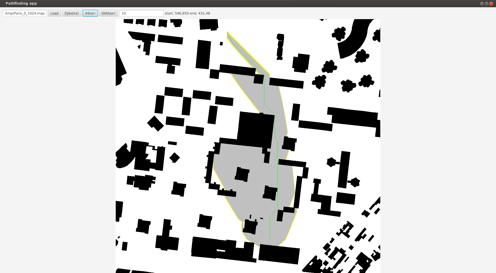

# Toteutusdokumentti

Ohjelma on jaeuttu eri pakkauksiin, joilla erilaisia vastuita. Ohjelman algoritmit ja tietorakenteet on toteutettu itse.

Ohjelman rakenne on seuraava:
```bash
└── pathfinding
    ├── algo
    │   ├── AStar.java
    │   ├── Djikstra.java
    │   ├── IDAStar.java
    │   ├── package-info.java
    │   └── PathFind.java
    ├── domain
    │   ├── Node.java
    │   ├── package-info.java
    │   ├── Point.java
    │   └── Result.java
    ├── file
    │   ├── MapReader.java
    │   ├── package-info.java
    │   ├── Scenario.java
    │   └── ScenarioReader.java
    ├── main
    │   ├── Main.java
    │   └── package-info.java
    ├── pathfinder
    │   ├── package-info.java
    │   └── PathFinder.java
    ├── struct
    │   ├── MinHeap.java
    │   ├── package-info.java
    │   └── StackQueue.java
    └── ui
        ├── BenchmarkUI.java
        ├── package-info.java
        └── UI.java
```

Ohjelman käyttöliittymä ja logiikka on eriytetty mahdollisimman paljon toisistaan.

## Suorituskyky- ja O-analyysivertailu

Ohjelman algoritmit saavuttavat tavoitteeksi asetetut aika- ja tilavaativuudet.

#### Saavutetut aika- ja tilavaativuudet

|Algoritmi|saavutettu aikavaativuus (pahin tapaus)|saavutettu tilavaativuus|
| :----:|:-----| :-----|
|Djikstra|O(n + m log n)|O(n)|
| AStar |O(n + m log n)| O(n)|
|IDAStar|O(m^n)|O(d)|

IDAStarin tilavaativuus on O(d), missä d on haun syvyys.

Tietorakenteet ja niiden käyttö ohjelmassa on optimoitu tehokkuutta silmälläpitäen.

### Aika -ja tilavaativuudet

#### pino (taulukkolista)

Pinon aikavaativuuden pahin tapaus on O (n).

```java
    public void push(Object p) {       
        if (last >= arrSize) {
            expandArray();
        }
        arr[last] = p;
        last++; 
    }
```

Pinon insert toimii vakioajassa O(1), paitsi jos taulukkoa tarvitsee kasvattaa tällöin insert toimii ajassa O(n).

```java
    private void expandArray() {
        arrSize = arrSize * 2;      
        T[] newArr = (T[]) new Object[arrSize];
        for (int i = 0; i < arr.length; i++) {
            newArr[i] = (T) arr[i];
        }
        arr = newArr;
    }
```

Muutoin pino toimii vakioajassa.

#### Minimikeko

Myös minimikeon insert toimii ajassa O(1), paitsi jos taulukon kokoa kasvatetaan.

Keon kekojärjestämisen pahimman tapauksen aikavaativuus on O(n log n).

### Suorituskykyvertailu

Testasin algoritmien toimintaa eri kartoilla ja skenaarioilla. Testauksessa käytetyt tiedostot löytyvät [repositoriosta](https://github.com/jussmaki/pathfinding-algorithms/tree/main/resources).

#### Vertailu skenaariotiedostoilla


|Algoritmi|kartta       |koko       |skenaarioita|kokonaisaika (s.)|kokonaismatka     |solmuja poluilla yhteensä     |vierailtuja solmuja yhteensä|
|:-------:|:-----------:|:---------:|:----------:|:---------------:|:----------------:|:----------------------------:|:--------------------------:|
|Djikstra|lt_house      |54 x 53    |20          |0.007377093      |88.84062043356596 |96                            |897                         |
|AStar   |lt_house      |54 x 53    |20          |0.005001814      |88.84062043356596 |96                            |102                         |
|IDAStar |lt_house      |54 x 53    |20          |0.002722529      |88.84062043356596 |96                            |2298                        |
|Djikstra|ht_store      |37 x 37    |80          |0.033507277      |1262.5849198858498|1174                          |22418                       |
|AStar   |ht_store      |37 x 37    |80          |0.018468832      |1262.5849198858498|1174                          |4695                        |
|IDAStar |ht_store      |37 x 37    |80          |> 60 min         |-                 |-                             |-                           |
|Djikstra|maze512-1-0   |512 x 512  |12120       |206.304204111    |2.9372697E7       |29384816                      |819141125                   |
|AStar   |maze512-1-0   |512 x 512  |12120       |281.687385589    |2.9372697E7       |29384816                      |704500998                   |
|IDAStar |maze512-1-0   |512 x 512  |12120       |-                |-                 |-                             |-                           |
|Djikstra|random512-10-0|512 x 512  |1780        |95.831965891     |633613.6738237863 |524934                        |248557033                   |
|AStar   |random512-10-0|512 x 512  |1780        |38.694554924     |633613.6738237863 |524934                        |46045289                    |
|IDAStar |random512-10-0|512 x 512  |1780        |-                |-                 |-                             |-                           |
|Djikstra|Paris_0_1024  |1024 x 1024|3820        |920.912456741    |2918386.0643204707|2442886                       |1817628238                  |
|AStar   |Paris_0_1024  |1024 x 1024|3820        |429.833178901    |2918386.0643204707|2442886                       |421062222                   |
|IDAStar |Paris_0_1024  |1024 x 1024|3820        |-                |-                 |-                             |-                           |
|Djikstra|Moscow_2_1024 |1024 x 1024|4230        |907.823410829    |3578387.394100259 |3034250                       |2090329028                  |
|AStar   |Moscow_2_1024 |1024 x 1024|4230        |907.823410829    |3578387.394100259 |3034250                       |2090329028                  |

IDAstar suoritui tässä testissä niin huonosti että kaikki skenaariot sillä sai kohtuullisessa (< 60 min) ajassa testattua vain yhdellä kartalla (lt_house). Kartassa ht_store jouduin keskeyttämään IDAStarin suorittamisen, koska se oli niin hidas. Näin ohjelman tulostuksista että se oli vieraillut loppuun asti ehtineissä skenaariossa huomattavasti useammassa solmussa kuin kilpailijansa kaikissa skenaarioissa yhteensä.

```bash
idastar 1086364021 ns. resources/ht_store start: 8,27 end: 21,9 distance: 24.55634918610405 nodes in path: 21 visited nodes: 33731086
idastar 1447820563 ns. resources/ht_store start: 8,29 end: 16,5 distance: 27.313708498984763 nodes in path: 25 visited nodes: 44907617
idastar 791018843 ns. resources/ht_store start: 14,22 end: 3,4 distance: 24.313708498984763 nodes in path: 22 visited nodes: 25616034
idastar 8559093714 ns. resources/ht_store start: 17,9 end: 5,30 distance: 27.142135623730955 nodes in path: 24 visited nodes: 261276055
idastar 4994736791 ns. resources/ht_store start: 9,31 end: 20,9 distance: 26.55634918610405 nodes in path: 23 visited nodes: 159725507
idastar 374379893 ns. resources/ht_store start: 17,29 end: 10,5 distance: 26.899494936611667 nodes in path: 25 visited nodes: 11712495
```

Isoimmilla kartoilla en edes yrittänyt suorittaa testejä IDAStarilla. Yllättävästi lt_house kartalla IDAStar oli kuitenkin ajallisesti paras.

#### Vertailu manuaalisesti suorittamalla

Sattuman vaikutuksen minimimoimiseksi tuloksista päätin suorittaa pari testiä niin että alku- ja loppupiste pysyivät samana ja sama algoritmi haki saman reitin useampaan kertaan. Nämä testit suoritettiin kolmella eri kartalla, pienellä kartalla, jotta IDAStaria voisi verrata muihin ja kahdella isolla kartalla: avoimella kaupungilla ja labyrintillä.
Testejä ajettiin kullakin algoritmilla per reitti 10, 100 ja 1000 kertaa.


|Algoritmi|kartta       |koko     |alkusolmu|loppusolmu|matka             |kertaa|min aika (s.)|avg aika (s.)|max aika (s.)|solmuja polulla|vieraillut solmut|
|:-------:|:-----------:|:-------:|:-------:|:--------:|:----------------:|:----:|:-----------:|:-----------:|:-----------:|:-------------:|:---------------:|
|Djikstra |lt_house     |54 x 53  |15,13    |39,22     |27.72792206135786 |10    |0.001393077  |0.002520396  |0.004716927  |25             |594              |
|Djikstra |lt_house     |54 x 53  |15,13    |39,22     |27.72792206135786 |100   |2.90204E-4   |6.60499E-4   |0.002927635  |25             |594              |
|Djikstra |lt_house     |54 x 53  |15,13    |39,22     |27.72792206135786 |1000  |1.26057E-4   |1.84049E-4   |0.006769921  |25             |594              |
|AStar    |lt_house     |54 x 53  |15,13    |39,22     |27.72792206135786 |10    |2.46601E-4   |4.15419E-4   |4.15419E-4   |25             |136              |
|AStar    |lt_house     |54 x 53  |15,13    |39,22     |27.72792206135786 |100   |1.27162E-4   |5.33172E-4   |0.004390185  |25             |136              |
|AStar    |lt_house     |54 x 53  |15,13    |39,22     |27.72792206135786 |1000  |7.0456E-5    |1.85881E-4   |0.003577842  |25             |136              |
|IDAStar  |lt_house     |54 x 53  |15,13    |39,22     |27.72792206135786 |10    |7.47615697   |7.574062571  |7.690634224  |25             |248484313        |
|IDAStar  |lt_house     |54 x 53  |15,13    |39,22     |27.72792206135786 |100   |7.539497864  |7.831211517  |8.367621551  |25             |248484313        |
|IDAStar  |lt_house     |54 x 53  |15,13    |39,22     |27.72792206135786 |1000  |-            |-            |-            |25             |-                |
|Djikstra |maze-512-8-2 |512 x 512|262,35   |259,439   |2150.2905473706182|10    |0.043028566  |0.061072568  |0.153549406  |1933           |164687           |
|Djikstra |maze-512-8-2 |512 x 512|262,35   |259,439   |2150.2905473706182|100   |0.042315037  |0.04559275   |0.079196385  |1933           |164687           |
|Djikstra |maze-512-8-2 |512 x 512|262,35   |259,439   |2150.2905473706182|1000  |0.042034712  |0.045415701  |0.104780463  |1933           |164687           |
|AStar    |maze-512-8-2 |512 x 512|262,35   |259,439   |2150.2905473706182|10    |0.069280715  |0.077832892  |0.123559837  |1933           |155243           |
|AStar    |maze-512-8-2 |512 x 512|262,35   |259,439   |2150.2905473706182|100   |0.068996672  |0.080785257  |0.080785257  |1933           |155243           |
|AStar    |maze-512-8-2 |512 x 512|262,35   |259,439   |2150.2905473706182|1000  |0.06913565   |0.072463426  |0.162932804  |1933           |155243           |
|Djikstra |Paris_0_1024|1024 x 1024|596,850 |431,48    |895.1980515339485 |10    |0.299518511  |0.319010915  |0.41316049   |803            |725362           |
|Djikstra |Paris_0_1024|1024 x 1024|596,850 |431,48    |895.1980515339485 |100   |0.294774359  |0.311485062  |0.380346897  |803            |725362           |
|Djikstra |Paris_0_1024|1024 x 1024|596,850 |431,48    |895.1980515339485 |1000  |0.27685195   |0.305681801  |0.753099331  |803            |725362           |
|AStar    |Paris_0_1024|1024 x 1024|596,850 |431,48    |895.1980515339485 |10    |0.067675589  |0.080184964  |0.160844828  |803            |110132           |
|AStar    |Paris_0_1024|1024 x 1024|596,850 |431,48    |895.1980515339485 |100   |0.066230519  |0.070037735  |0.103277439  |803            |110132           |
|Astar    |Paris_0_1024|1024 x 1024|596,850 |431,48    |895.1980515339485 |1000  |0.066409007  |0.069654844  |0.099988778  |803            |110132           |

Tulokset olivat odotettuja. IDAStar oli jälleen huonoin algoritmi. En jäänyt odottamaan kuinka kauan sen suoritus 1000 kertaa kestäisi edes pienimmällä kartalla. Djikstra selvisi ajassa mitattuna AStaria paremmin labyrintissä (maze_512-8-2) ja AStar kaupungissa (Paris_0_1024).

##### Djikstran ja AStarin ero kuvina

Kuvissa algoritmin vierailemat solmut on väritetty harmaalla.

###### Djikstra labyrintissä


###### AStar labyrintissä


###### Djikstra kaupungissa


###### AStar kaupungissa



#### Vertailujen tuloksista

Algoritmit suorituivat vertailuista ennakkodotusten mukaisesti. Parhaiten kokonaisuudessaan suoritui AStar ja sen jälkeen Djikstra. Selvästi huonoiten, jopa odotettua huonommin, suoriutui IDAStar. Kaikkien testitapausten suorittaminen loppuun myös IDAStarilla olisi vienyt arvioilta todella paljon aikaa.

Algoritmien vierailemien solmujen visualisinti käyttöliittymässä auttoi minua ymmärtämään miksi AStar on Djikstraa parempi erityisesti kartalla, jossa kohdesolmusta lähtösolmuun pääsee etenemään suoraan tai lähes suoraan linnunutietä.

AStar oli näissä testeissä selvästi paras. AStarin heuristiikalla pyritään välttämään vierailemasta turhaan solmuissa, joiden euklidiaaninen etäisyys kohdesolmusta on kaukana solmusta missä kulloinkin ollaan.

Toiseksi parhaiten testeistä suoritui Djikstra, eikä sen ero AStariin ole kovin suuri silloin kun suoraan linnuntietä ei ole mahdollista kulkea.

Huonoin oli IDAStar, joka on kyllä ansiokas siinä että sen tilavaativuus on pieni, mutta se voi vierailla haun aikana samassa solmussa useita kertoja ja tähän menevä aika tekee siitä käyttökelvottoman isommissa verkoissa. Tiesin IDAStarin useimmissa tapauksissa olevan hidas algoritmi, mutten odottanut sen olevan niin hidas mitä ohjelmaa tehdessä ja testattaessa tuli ilmi.

## Työn mahdolliset puutteet ja parannusehdotukset

Skenaarioilla testaamisen voisi lisätä mahdollisuuden etsiä sama reitti monta kertaa ja ottaa tuloksiin siitä keskiarvo.

IDAStarin voisi korvata JPS:llä, koska IDAStar on niin hidas että käytännössä kunnollinen vertailu on mahdotonta.

Suorituskykytestejä olisi voinut tehdä vielä useammilla syötteillä.

Myös tietorakenteiden suorityskykyä voisi vertailla.

Kartta-aineisto voisi olla vielä monipuolisempaa.

Graafisen käliin voisi toteuttaa samat toiminnot kuin tekstikäyttöliittymässä.

## Lähteet

Wikipedia: [Djikstra’s algorithm](https://en.wikipedia.org/wiki/Dijkstra's_algorithm), luettu 22.1.2021

Wikipedia: [A* search algorithm](https://en.wikipedia.org/wiki/A*_search_algorithm), luettu 22.1.2021

Wikipedia: [Iterative deepening A*](https://en.wikipedia.org/wiki/Iterative_deepening_A*), luettu 10.2.2021

Tietorakenteet -ja algoritmit luentomoniste 2020.


